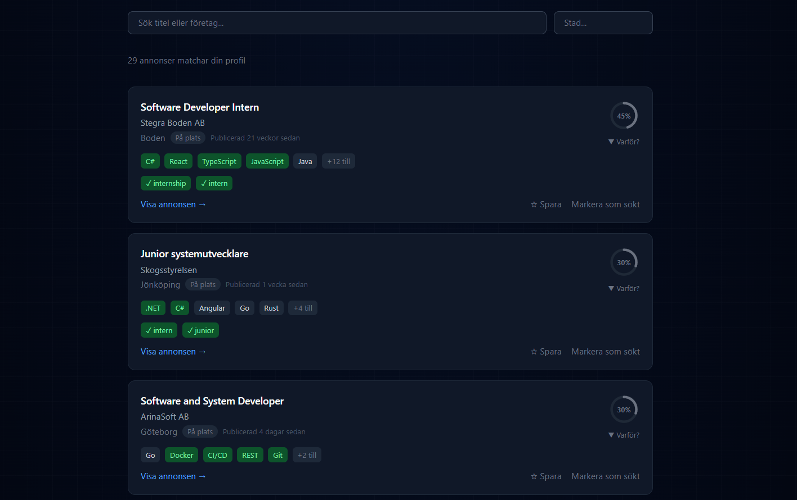
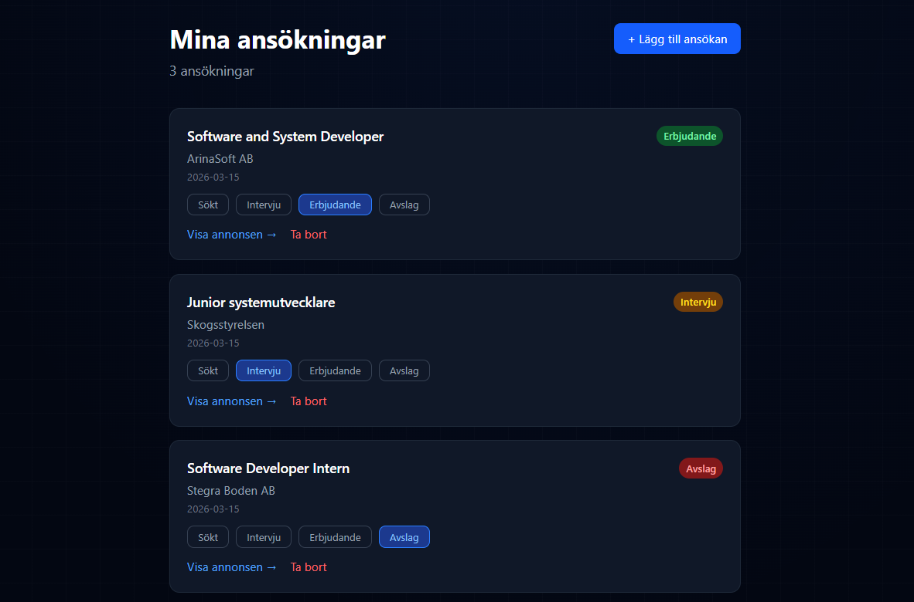

# LIAHub Frontend


**LIAHub** is a tech internship and junior job discovery platform built for tech students in Sweden. It pulls listings from Arbetsförmedlingen's API, ranks them by tech stack match, and lets users track their applications — all in one place.

🔗 **Live:** [liahub.meghdadjafari.dev](https://liahub.meghdadjafari.dev)  
🔗 **Backend repo:** [liahub-backend](https://github.com/Megjafari/liahub-backend)

---

## Screenshots




## Features

- **Job matching** — listings ranked by how well they match the user's tech stack
- **Match score ring** — visual percentage ring per job card showing skill overlap
- **Google OAuth** — one-click sign in via Supabase Auth, no passwords
- **Auth modal** — triggered on protected actions (save, apply, alerts) without leaving the page
- **Save jobs** — bookmark listings for later
- **Mark as applied** — track which jobs you've applied to directly from the listing
- **Manual application tracking** — add jobs found outside the platform (LinkedIn, Indeed, etc.) with fields for company, location, source, link, contact, status and notes
- **Application tracker** — full status tracking: Sökt → Intervju → Erbjudande / Avslag
- **Tech stack profile** — set your skills and get ranked results automatically
- **Job age** — see when each listing was published relative to today
- **Loading skeleton** — smooth placeholder animation while data loads
- **Back to top button** — appears after scrolling, smooth scroll back
- **Page transitions** — animated route changes via Framer Motion
- **Mobile responsive** — full mobile navigation with slide-out menu
- **Dark theme** — consistent dark UI throughout

---

## Tech Stack

| Layer | Technology |
|-------|-----------|
| Framework | React 18 |
| Language | TypeScript |
| Bundler | Vite |
| Styling | Tailwind CSS |
| Auth | Supabase (Google OAuth) |
| HTTP | Axios |
| Routing | React Router v6 |
| Animations | Framer Motion |
| Date picker | react-datepicker |
| Deploy | Vercel |

---

## Project Structure

```
src/
├── components/
│   ├── AuthModal.tsx         # Login modal for protected actions
│   ├── BackToTop.tsx         # Fixed scroll-to-top button
│   ├── Footer.tsx            # Site footer with navigation
│   └── PageTransition.tsx    # Animated route wrapper
├── context/
│   └── AuthModalContext.ts   # Global auth modal state
├── hooks/
│   ├── useApplications.ts    # Application CRUD logic
│   ├── useAuthModal.ts       # Modal open/close + pending action
│   ├── useJobs.ts            # Job fetching with filters and pagination
│   ├── useNotifications.ts   # Notification settings
│   ├── useProfile.ts         # User profile management
│   └── useSavedJobs.ts       # Save/unsave job logic
├── pages/
│   ├── ApplicationsPage.tsx  # Application tracker with manual entry form
│   ├── DashboardPage.tsx     # Stats overview
│   ├── HomePage.tsx          # Job list with filters, match scores, job cards
│   ├── IntegritetspolicyPage.tsx
│   ├── JobDetailPage.tsx     # Single job view
│   ├── KontaktPage.tsx       # Contact page
│   ├── OmPage.tsx            # About page
│   ├── ProfilePage.tsx       # Tech stack and profile settings
│   └── SavedJobsPage.tsx     # Saved jobs list
├── services/
│   ├── api.ts                # Axios instance with JWT interceptor
│   └── supabase.ts           # Supabase client
├── types/
│   └── index.ts              # Shared TypeScript interfaces
├── App.tsx                   # Root layout, navbar, auth state, routing
└── main.tsx                  # App entry point
```

---

## Getting Started

### Prerequisites

- Node.js 18+
- A running instance of the [LIAHub backend](https://github.com/Megjafari/liahub-backend)
- A Supabase project with Google OAuth enabled

### Installation

```bash
git clone https://github.com/Megjafari/liahub-frontend
cd liahub-frontend
npm install
```

### Environment Variables

Create a `.env` file in the root:

```env
VITE_SUPABASE_URL=your-supabase-url
VITE_SUPABASE_ANON_KEY=your-supabase-anon-key
VITE_API_URL=your-backend-url
```

### Run Locally

```bash
npm run dev
```

The app will be available at `http://localhost:5173`.

---

## Deployment

The frontend is deployed on **Vercel** with automatic deploys on push to `master`.

Set the following environment variables in Vercel:

| Variable | Description |
|----------|-------------|
| `VITE_SUPABASE_URL` | Your Supabase project URL |
| `VITE_SUPABASE_ANON_KEY` | Your Supabase anon key |
| `VITE_API_URL` | Your backend URL (e.g. Railway) |

---

## Authentication Flow

Authentication is handled via **Supabase Google OAuth**. Users can browse job listings without logging in. Protected actions (saving jobs, marking as applied, enabling alerts) trigger an auth modal that prompts login without navigating away from the current page. After successful login, the original action completes automatically.

---

## Application Tracker

The applications section supports two sources:

- **Platform jobs** — marked directly from job cards via "Markera som sökt"
- **Manual entries** — jobs found elsewhere (LinkedIn, Indeed, company websites, etc.) added via a form with fields for title, company, location, source URL, contact info, applied date, status and notes

Status options: `Sökt` → `Intervju` → `Erbjudande` / `Avslag`
